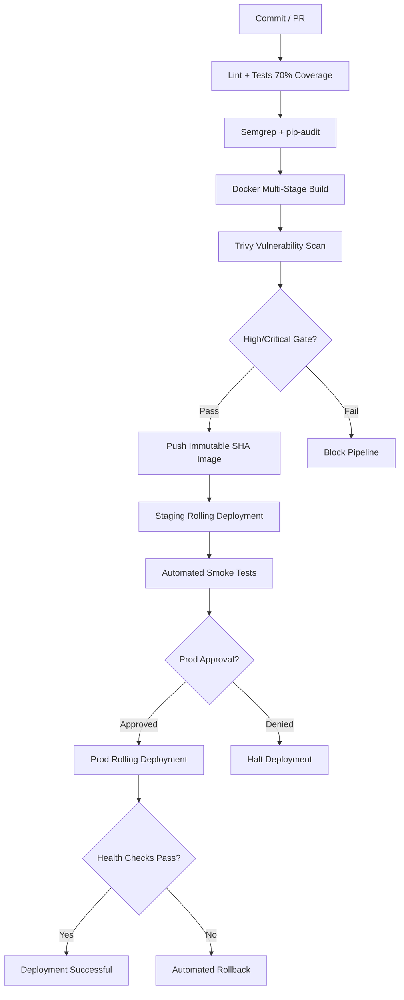

## Pipeline

```mermaid

graph TD
    Start[Commit / PR] --> Quality[Lint + Tests 70% Coverage]
    Quality --> SecStatic[Semgrep + pip-audit]
    
    SecStatic --> DockerBuild[Docker Multi-Stage Build]
    DockerBuild --> Trivy[Trivy Vulnerability Scan]
    
    Trivy --> Gate1{High/Critical Gate?}
    Gate1 -- Pass --> PushImage[Push Immutable SHA Image]
    Gate1 -- Fail --> Block1[Block Pipeline]
    
    PushImage --> StageDeploy[Staging Rolling Deployment]
    StageDeploy --> Smoke[Automated Smoke Tests]
    
    Smoke --> Gate2{Prod Approval?}
    Gate2 -- Approved --> ProdDeploy[Prod Rolling Deployment]
    Gate2 -- Denied --> Block2[Halt Deployment]
    
    ProdDeploy --> HealthCheck{Health Checks Pass?}
    HealthCheck -- Yes --> Success[Deployment Successful]
    HealthCheck -- No --> Rollback[Automated Rollback]


```
